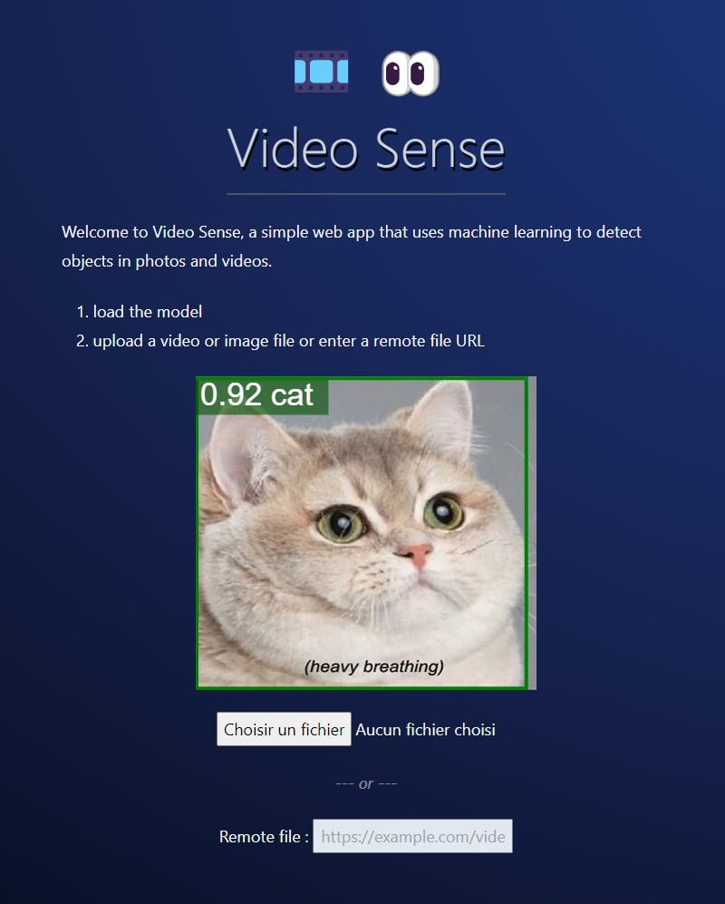

# Video Sense

> Simple web app that uses machine learning to detect objects in photos and videos

## Demo

[Try it online](https://video-sense.netlify.app)

[Hosting graciously provided by Netlify](https://www.netlify.app)

## Samples

- [earth.mp4](https://file-examples.com/wp-content/storage/2017/04/file_example_MP4_1280_10MG.mp4)
- [bunny.mp4](https://www.learningcontainer.com/wp-content/uploads/2020/05/sample-mp4-file.mp4)
- [bird.jpg](https://pixabay.com/photos/kingfisher-bird-nature-forest-8256375/) : Image by AKA23 from Pixabay
- [man.jpg](https://pixabay.com/photos/man-coffee-outdoors-lake-lakeside-3803551/) : Image by melancholiaphotography from Pixabay
- [waves.mkv](https://filesamples.com/samples/video/mkv/sample_1920x1080.mkv)

## Thanks

- [Favicon.io](https://favicon.io/) : for the "VS" favicon rounded #FFF & #50A with Kdam font size 100
- [Loading.io](https://loading.io/) : for the loading animation
